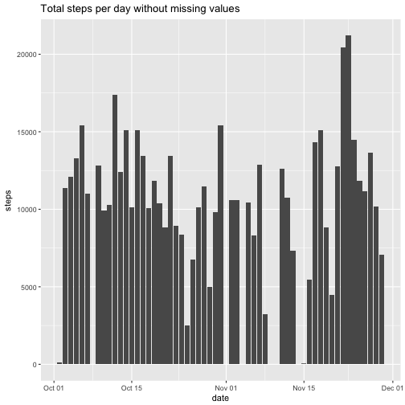

```r
---
title: "Reproducible Research: Peer Assessment 1"
output: 
  html_document:true
    keep_md: true
---
```

```
## Error: <text>:7:0: unexpected end of input
## 5:     keep_md: true
## 6: ---
##   ^
```

## Loading and preprocessing the data

```r
    if(file.exists("activity.zip")){
        unzip("activity.zip")}else{
        fileurl<-"https://d396qusza40orc.cloudfront.net/repdata%2Fdata%2Factivity.zip"
    download.file(fileurl,file="activity.zip")
    unzip("activity.zip")
    }
    activity<-read.csv("activity.csv")
```
## What is mean total number of steps taken per day?

```r
totalstep<-aggregate(steps~date,activity,sum)
totalstep$date<-as.Date(totalstep$date,"%Y-%m-%d")
```
The histogram of the totla steps per day without missing value

```r
library(ggplot2)
p<-ggplot(totalstep,aes(date,steps))
p+geom_bar(stat = "identity")+ggtitle("Total steps per day without missing values")
```



```r
meanstep<-mean(totalstep$steps)
medianstep<-median(totalstep$steps)
```
The mean and median of the total number of steps taken per day are 1.0766189 &times; 10<sup>4</sup> and 10765.

## What is the average daily activity pattern?


```r
intervalstep<-aggregate(steps~interval,activity,mean)
ggplot(intervalstep,aes(interval,steps))+geom_bar(stat = "identity")
```


```r
maxindex<-which.max(intervalstep$steps)
intervalindex<-intervalstep[maxindex,]$interval
stepsnumber<-intervalstep[maxindex,]$steps
```
The maxium steps is 206.1698113 in the interval 835
## Imputing missing values

```r
#imputing missing value with the average of the related interval 
nacount<-sum(is.na(activity))
for(i in 1:nacount){
    rowindex<-which(is.na(activity),arr.ind = TRUE)[i,][1]
    intervalI=activity[rowindex,]$interval
    imputingnumber=intervalstep[which(intervalstep$interval==intervalI),]$steps
    activitynew[rowindex,]$steps<-imputingnumber
}
write.csv(activitynew,file = "activitynew.csv",sep = ",")
```

```
## Warning in write.csv(activitynew, file = "activitynew.csv", sep = ","):
## attempt to set 'sep' ignored
```
The histogram of the totla steps per day with imputing missing value

```r
totalstepnew<-aggregate(steps~date,activitynew,sum)
totalstepnew$date<-as.Date(totalstepnew$date,"%Y-%m-%d")
library(ggplot2)
p<-ggplot(totalstepnew,aes(date,steps))
p+geom_bar(stat = "identity")+ggtitle("Total steps per day with imputing missing values")
```


```r
meanstepnew<-mean(totalstepnew$steps)
medianstepnew<-median(totalstepnew$steps)
```
The mean and median of the total number of steps taken per day with the new dataset are 1.0766189 &times; 10<sup>4</sup> and 1.0766189 &times; 10<sup>4</sup>. Compared to the old dataset the median incresed, the mean remians the same.
## Are there differences in activity patterns between weekdays and weekends?

```r
list1<-list("Monday","Tuesday","Wednesday","Thursday","Friday")
list2<-list("Sunday","Saturday")
activitynew$day<-weekdays.Date(as.Date(activitynew$date,"%Y-%m-%d"))
activitynew[activitynew$day %in% list1, ]$day<-"weekday"
activitynew[activitynew$day %in% list2, ]$day<-"weekend"
activitynew$day<-factor(activitynew$day)
```

```r
intervalstepnew<-aggregate(steps~interval+day,activitynew,mean)
p<-ggplot(intervalstepnew,aes(interval,steps))+geom_line(stat = "identity")
p+facet_grid(day~.)+ggtitle("Weekday and weekend steps per interval")
```


